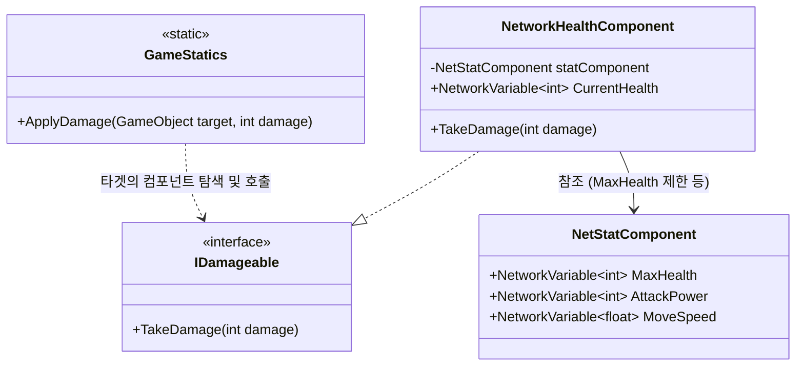

# [A급 작업: 체력, 피해 및 스탯 시스템 구조 구축]

모든 개체(플레이어, 몬스터 등)가 공통으로 사용할 스탯(Stat), 체력(Health), 피해(Damage) 처리 시스템을 구축합니다. 서버 권한(Server Auth)을 유지하며, RPC를 통한 정확한 피격 연출 동기화를 보장합니다.

## User Review Required

> [!IMPORTANT]
> **GameStatics를 통한 데미지 파이프라인 중앙 집중화**
> 무기나 스킬이 대상을 직접 때리는 대신 `GameStatics.ApplyDamage(GameObject target, int amount)`를 호출하는 파이프라인을 구축합니다. 이를 통해 방어력 차감, 크리티컬 계산, 스탯 기반 데미지 증폭 공식을 `GameStatics` 한 곳에서 깔끔하게 통제할 수 있습니다.

> [!IMPORTANT]
> **스탯과 체력의 분리 구조 (StatComponent vs HealthComponent)**
> 스탯(최대 체력, 공격력, 이동 속도 등)을 관리하는 `NetStatComponent`와, 현재 체력 및 피격 로직을 담당하는 `NetworkHealthComponent`를 분리합니다.

## Proposed Architecture

### 1. `GameStatics.cs` (전역 데미지 게이트웨이 추가)
- **추가 메서드**: `public static void ApplyDamage(GameObject target, int baseDamage)` (추후 타격 주체 매개변수도 추가 가능)
- **역할**: 전역 데미지 공식을 관장합니다. 들어온 `target`에서 `IDamageable`과 `NetStatComponent`를 찾아 방어력을 뺀 최종 데미지를 계산하고, `TakeDamage`를 호출해 줍니다. 

### 2. `NetStatComponent.cs` (스탯 데이터 센터)
캐릭터의 영구적/가변적 기본 스탯을 모두 쥐고 있는 컴포넌트입니다.
- **역할**: 최대 체력, 이동 속도, 방어력, 공격력 등 데이터 제공.

### 3. `NetworkHealthComponent.cs` (피격/체력 로직 전담)
오직 '현재 체력'과 '피격/사망 연출'만 관리합니다.
- **역할**: `TakeDamage`가 들어오면 `CurrentHealth` 차감, 0 이하 시 사망 처리. 피격/사망 시 `ClientRpc` 발송.
- **상호작용**: 초기화 및 회복 시 `NetStatComponent.MaxHealth`를 초과하지 않도록 제한.

### 4. `IDamageable.cs` (피해 인터페이스)
- **역할**: `TakeDamage(int damage)` 시그니처를 제공.

## Verification Plan
1. 에디터에서 빈 오브젝트에 `NetStatComponent`와 `NetworkHealthComponent` 부착.
2. 테스트 스크립트에서 `GameStatics.ApplyDamage(obj, 10)` 호출.
3. `GameStatics`가 객체의 `IDamageable`을 찾아 데미지를 먹이고, 최종적으로 체력이 깎이며 RPC가 터지는지 확인.
